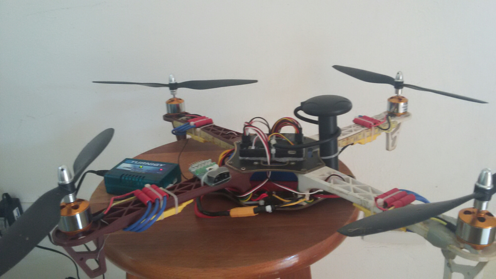
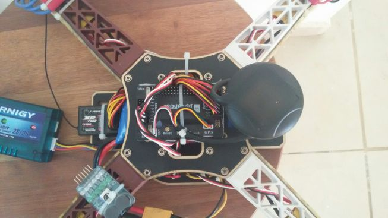
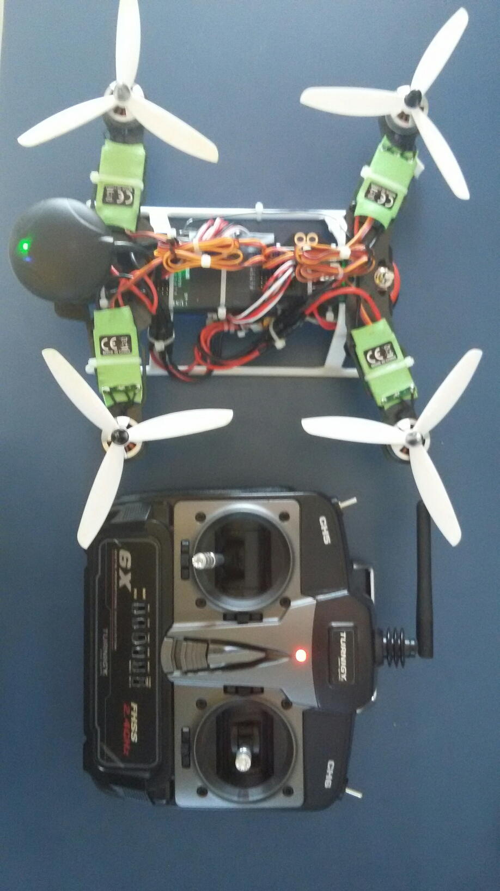
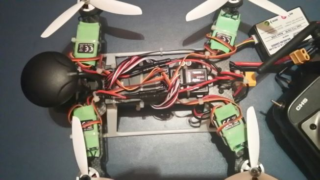
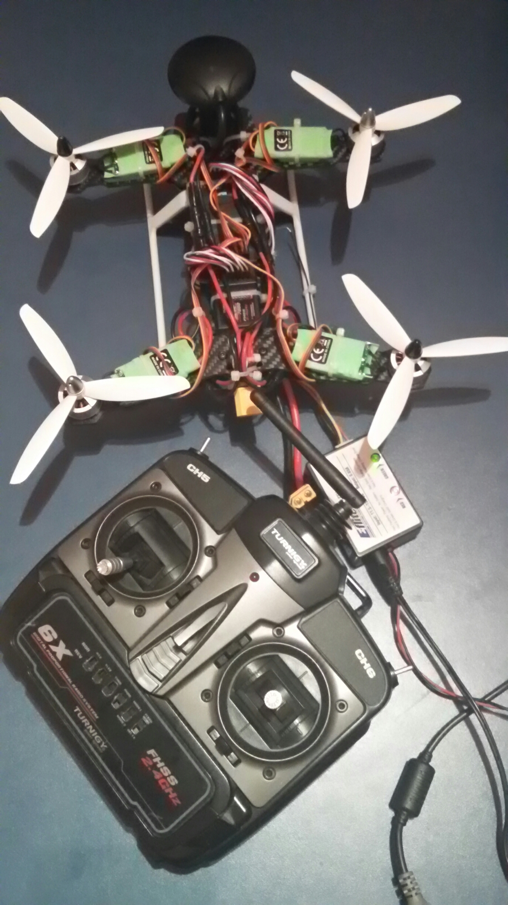

# Old days playing with quadcopters / drones with 4 engines  

## This was my first quadcopter. The frame was broken multiple times. :)  

  

 

## This was my second quadcopter. Smaller but still very powerful.  

– tarot frame 250mm;  
– turnigy ESCs;  
– turnigy motors;  
– APM v6;  
– turnigy battery.  

 

 

 

Note: they are all dismantled now - waiting for better batteries. 20min fly is too quick.   